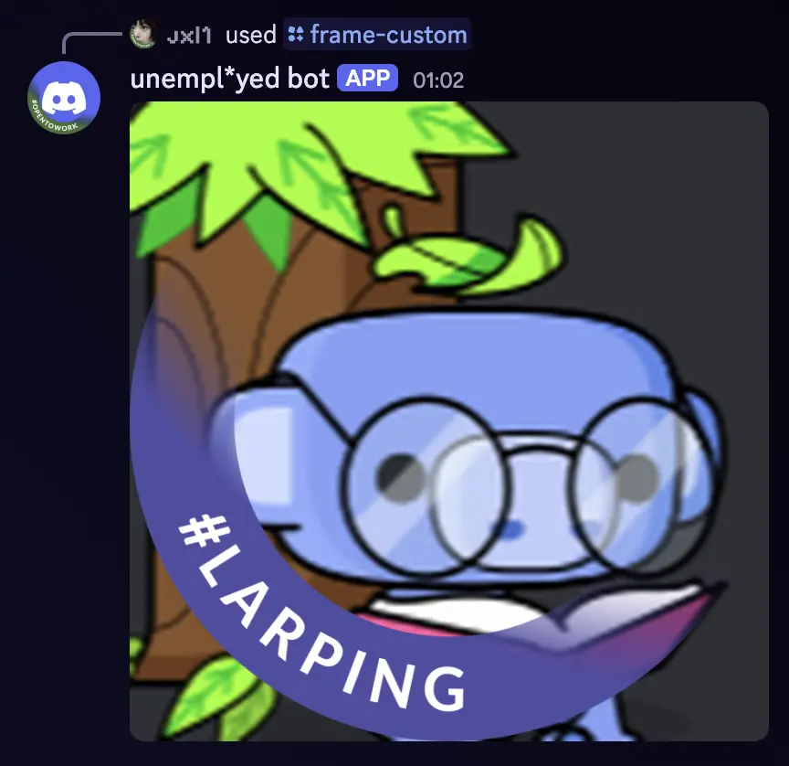

# linkedin-frame

Apply LinkedIn-style circular frames with custom arc text to profile pictures — as a **Discord bot** and as a **browser-based web app** (hosted on GitHub Pages).

Supports both static images and animated GIFs.

 

## Web app

**https://jxl-s.github.io/linkedin-frame/**

Upload any image or GIF, pick a color and arc text, and download the result.

## Discord bot

### Commands

#### `/frame-custom`
Apply a custom-colored frame with custom arc text to a user's profile picture.

| Parameter | Description |
|-----------|-------------|
| `user` | The Discord member whose profile picture to use |
| `color` | Frame color as a hex code (e.g. `#5865F2`) |
| `text` | Text to display on the arc |

#### `/frame-opentowork`
Apply the LinkedIn `#OPENTOWORK` frame (green, `#457032`) to a user's profile picture.

| Parameter | Description |
|-----------|-------------|
| `user` | The Discord member whose profile picture to use |

### Setup

#### Docker (recommended)

**1. Create a `.env` file:**
```
DISCORD_TOKEN=your_bot_token_here
```

**2. Run with Docker Compose:**
```bash
docker compose up -d
```

Or with `docker run`:
```bash
docker build -t discord-linkedin-frame .
docker run -d --restart unless-stopped -e DISCORD_TOKEN=your_bot_token_here discord-linkedin-frame
```

#### Manual

**1. Install dependencies**
```bash
python3 -m venv .venv
.venv/bin/pip install -r requirements.txt
```

**2. Configure environment**

Create a `.env` file at the project root:
```
DISCORD_TOKEN=your_bot_token_here
```

**3. Run**
```bash
.venv/bin/python3 main.py
```

Slash commands are synced globally on startup.

## Project structure

```
main.py           # Discord bot entry point and slash commands
lib/
  frame.py        # Applies colored ring frame using assets/alpha.png
  text.py         # Renders text along a circular arc
  process.py      # Combines frame + text, handles static and animated GIFs
assets/
  alpha.png       # Frame alpha mask (grayscale: white = frame, black = avatar)
  Carlito-Bold.ttf
index.html        # Web app
js/
  app.js          # Web app logic (mirrors lib/ in the browser)
  vendor/         # gif.js, gif.worker.js, omggif.js
```
